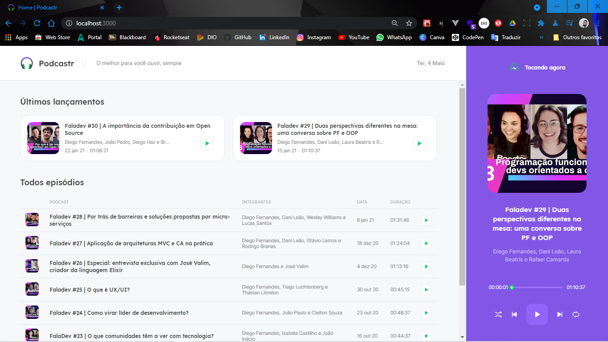
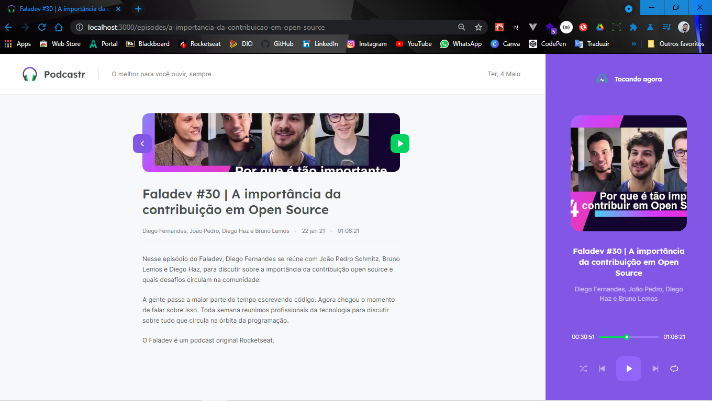
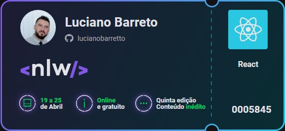

<h1 align="center">
  
 </h1>

<h1 align="center">
  NLW#05 - Trilha ReactJS
</h1>

<br>

<h2 align="center">Construindo um projeto do zero com os fundamentos do Next.js, ReactJS e NodeJS (Rocketseat)</h2>

<br>

<p align="center">
  <a href="#page_facing_up-descrição">Descrição</a>&nbsp;&nbsp;&nbsp;|&nbsp;&nbsp;&nbsp;
  <a href="#art-Layout">Layout</a>&nbsp;&nbsp;&nbsp;|&nbsp;&nbsp;&nbsp;
  <a href="#-tecnologias">Tecnologias</a>&nbsp;&nbsp;&nbsp;|&nbsp;&nbsp;&nbsp;
  <a href="#clipboard-Funcionalidades">Funcionalidades</a>&nbsp;&nbsp;&nbsp;|&nbsp;&nbsp;&nbsp;
  <a href="#closed_book-instalação">Instalação</a>&nbsp;&nbsp;&nbsp;|&nbsp;&nbsp;&nbsp;
  <a href="#memo-Licença">Licença</a>
</p>

<br>

## :page_facing_up: Descrição
<h5 align="center">O Podcastr é um app para ouvir podcasts sobre o desenvolvimento web/mobile,  programação e afins...<br>
  Este projeto apresenta os fundamentos do Next.js, como ele transforma a nossa maneira de desenvolver aplicações front-end e conceitos importantes como SSR e SSG. Também como o front-end se transformou nos últimos anos com a possibilidade de termos funções back-end (serverless) executando em um ambiente front-end. É muito comum o desenvolvimento de aplicações front-end que não estão conectadas a um único back-end hoje em dia, por isso, aqui está o conceito de JAMStack e como conectar nosso front-end com um CMS.  :octocat:</h5>

<br>

<p align="center">
  <kbd></kbd>
</p>

<br>

<p align="center">
  <kbd></kbd>
</p>

<br>

<p align="center">
  <kbd></kbd>
</p>

<br>

<p align="center">
  <kbd></kbd>
</p>

#

<h3 align="center">#Participação na 5º edição do Next_Level_Week, de 19 a 25 de abril de 2021</h3>

<br>

<p align="center">
  <kbd></kbd>
</p>

<br>

## :art: Layout
Você pode acessar o Layout pelo <a href="https://www.figma.com">Figma<a> atravês <a href="https://www.figma.com/file/5KchzYko8NeeV0suqrSi6x/Podcastr-(Copy)?node-id=199599%3A1028">desse link<a>.

<br>

## 🛠 Tecnologias
Este projeto foi desenvolvido com as seguintes tecnologias

- [Next.js](https://nextjs.org/)
- [React.js](https://pt-br.reactjs.org/)
- [TypeScript](https://www.typescriptlang.org/)
- [Sass](https://sass-lang.com/)

<br>

## :clipboard: Funcionalidades
- [x] Tocar podcast.
- [x] Quando um podcast acaba, outro começa em seguida.
- [x] Selecionar apenas um podcast para ouvir.
- [x] Opção de ir para o próximo podcast.
- [x] Opção de ir para o anterior podcast.
- [x] Opção de Loop.
- [x] Opção para embaralhar.

<br>

## :closed_book: Instalação

### Pré-requisitos
Antes de começar, você vai precisar ter instalado em sua máquina as seguintes ferramentas:
[Git](https://git-scm.com), [Node.js](https://nodejs.org/en/), Além disto é bom ter um editor para trabalhar com o código como [VSCode](https://code.visualstudio.com/)

```bash
# Clone este repositório.
$ git clone https://github.com/Lucianobarretto/Podcastr.git

# Vá para a pasta Podcastr
$ cd Podcastr

# Instale as dependências
$ yarn install 

# Execute aplicação
$ yarn dev

# Execute o servidor
$ yarn server

# O app vai está rodando na porta 3000 - acesse <http://localhost:3000>
```
<br>

## :memo: Licença

<h5 align="center">Esse projeto está sob a licença MIT. Veja o arquivo LICENSE para mais detalhes.</h5>


<p align="center">  
  <a href="https://github.com/Lucianobarretto/Podcastr/blob/main/LICENSE.md">
    
  </a>
</p>

---

<p align="center">
  
</p>

<p align="center">  
  <a href="https://www.linkedin.com/in/lucianobalmeida/">
    
  </a>  
</p>
