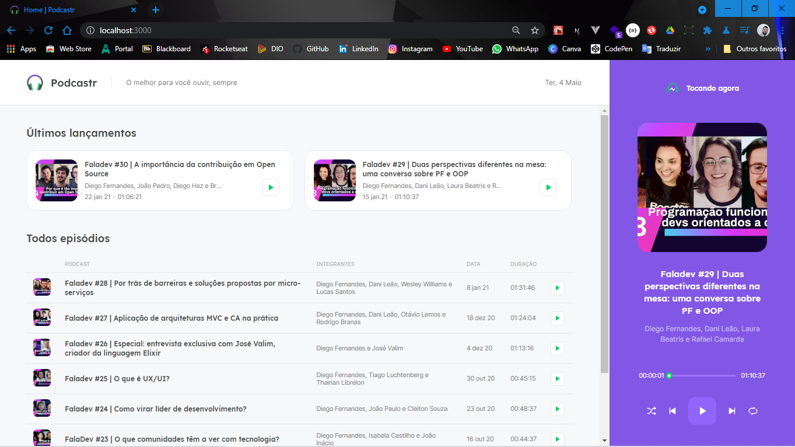

# <h1 align="center">Podcastr (NLW#05 - Trilha ReactJS)</h1>

 

<h2 align="center">Construindo um projeto do zero com os fundamentos do Next.js, ReactJS e NodeJS (Rocketseat)</h2>

 

  <kbd></kbd>

 

<h5 align="center">Este projeto apresenta os fundamentos e como o Next.js transforma a nossa maneira de desenvolver aplicações front-end e conceitos importantes como SSR e SSG. Também como o front-end se transformou nos últimos anos com a possibilidade de termos funções back-end (serverless) executando em um ambiente front-end. É muito comum o desenvolvimento de aplicações front-end que não estão conectadas a um único back-end hoje em dia, por isso, aqui está o conceito de JAMStack e como conectar nosso front-end com um CMS.  :octocat:</h5>

 

  <kbd></kbd>

 

  <kbd></kbd>

#

<h3 align="center">#Participação na 5º edição do Next_Level_Week, de 19 a 25 de abril de 2021</h3>

 

  <kbd></kbd>

 

<h2 align="center">Under Construction</h2>

 

  <kbd></kbd>

#

<h3 align="center">Licença</h3>
<h6 align="center">Esse projeto está sob a licença MIT. Veja o arquivo LICENSE para mais detalhes.</h6>

  
  

---

  
    

